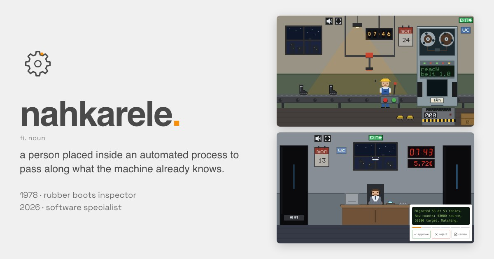

# nahkarele

**Interactive nahkarele simulator.** _Nahkarele_ (Finnish, "leather relay") is an old
term for a person placed inside an automated process to pass along what the machine
already knows. The 2026 edition is the _meat proxy_: the human between two AI agents.

[](https://nahkarele.invinite.tech)

Two jobs:

- **1978 · kumitehdas.** Rubber boots stop at your gate one by one. Stamp the defective
  ones, pass the rest, before the queue backs up and boots fall on the floor. Work fast and
  the belt speeds up. After you, TÄ'h (a tape-drive computer with an x-ray) re-checks every
  boot. By Friday the factory makes phones. Five days, a performance review each day,
  graded 4–10.
- **2026 · software specialist.** A desk between AI #1 and AI #2. Every message between them
  crosses your desk for approval, then a calculation, then a sum, then just an OK button.
  They act on it anyway. By Friday a brain in a jar has the desk.

Output is identical whatever you do. Salary accrues regardless.

## Develop

```sh
yarn install
./install-hooks.sh   # pre-commit runs yarn validate
yarn dev             # http://localhost:5173
yarn validate        # typecheck + lint + format + unit tests
yarn build           # static SPA in dist/
```

SvelteKit (adapter-static) + Svelte 5 runes, [halo-design](https://github.com/eetu/claude-skills)
tokens, yarn vendored in `.yarn/releases/`, node pinned in `.node-version`.

Both games are pure engines (`src/lib/factory/`, `src/lib/office/`) with vitest tests; the
factory's asserts that its output does not depend on the player. Sprites are
[dab](https://github.com/eetu/dab) character-grid JSON in `src/lib/sprites/`.
The orientation cassette's reel physics come from
[eetu/scene](https://github.com/eetu/scene/blob/main/packages/player/src/cassette.ts).

## Container

```sh
podman build -t nahkarele .
podman run --rm -p 8080:8080 nahkarele   # http://localhost:8080
```

Rootless nginx on port 8080, published to `ghcr.io/eetu/nahkarele` on `main` and `v*`
tags. Optional [Liwan](https://liwan.dev) analytics, off unless `LIWAN_SCRIPT_URL` and
`LIWAN_ENTITY` are both set (same as [logo](https://github.com/eetu/logo)).
